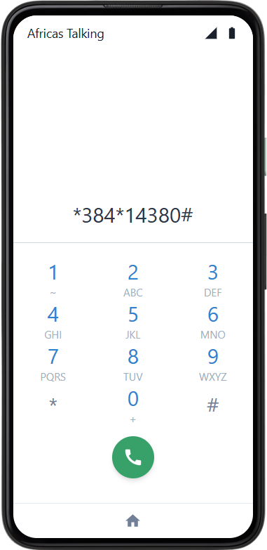
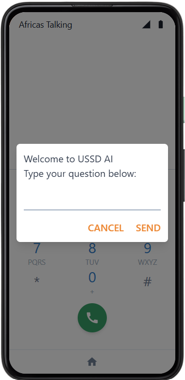
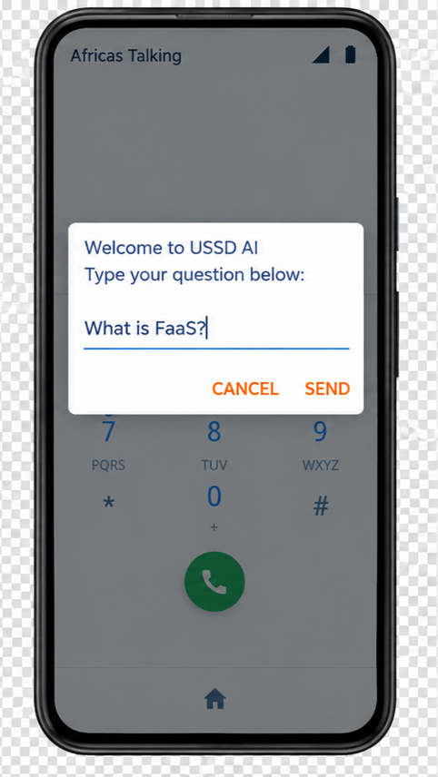
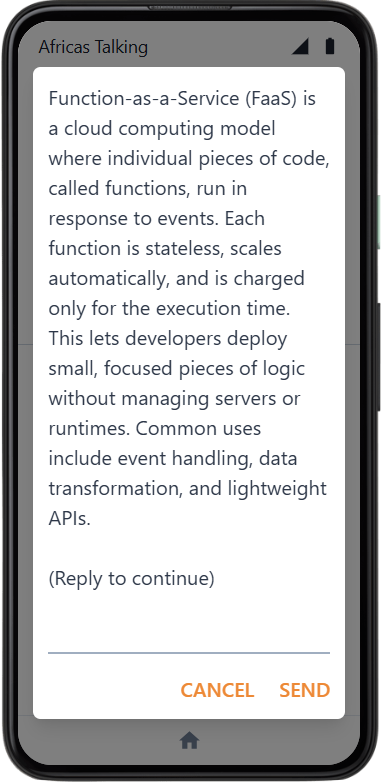

# USSD AI

Talk to an LLM from any phone — no app, no data, no smartphone required. Just dial and type.

## Why bother?

Most "AI access" assumes you've got a smartphone, a data plan, and decent coverage. A huge chunk of Africa's mobile users have none of the above — just a GSM connection and USSD, the same protocol that powers mobile money and airtime top-up menus. This project rides that same rail: dial a shortcode, type a question, get an answer back on your screen. No internet required, because USSD never touches the internet — it's signaling over the cellular network itself.

## Demo
<p align="center">
  
  
  
  
</p>

*Dialing the shortcode → welcome screen → asking a question → getting an answer*

## How it works

Phone → USSD session → Africa's Talking → this webhook → Groq (LLM) → back down the chain 

1. User dials the shortcode; Africa's Talking opens a USSD session and calls our `POST /ussd` webhook.
2. On the first hit (empty `text`), we start a fresh conversation and greet the user.
3. Every reply the user types comes back as an accumulated `*`-delimited string — we just take the last segment as the new prompt.
4. The prompt gets appended to that session's message history and sent to Groq.
5. The model's reply is sent back as `CON ...` (keep the session open) so the user can keep chatting, all the way until the session times out or errors out.

Session history lives entirely in memory, keyed by `sessionId`, and self-destructs after 3 minutes of inactivity.

## Status

**Sandbox only.** This runs against Africa's Talking's USSD simulator, not a live shortcode. There's no telco billing integration, no carrier agreement, and — deliberately — no plan to go live. Consider this a working proof of concept, not a service you can dial from a real SIM today.

## Tech stack

- **Runtime:** Node.js + TypeScript, compiled with `tsc`
- **Framework:** Express 5
- **LLM:** Groq API (`groq-sdk`), model `openai/gpt-oss-20b`
- **Telco/aggregator:** Africa's Talking (USSD sandbox)

- **Container:** Multi-stage Docker build, runs as non-root `node` user

## Setup

### Prerequisites

- Node.js 22+
- An Africa's Talking account with USSD sandbox access
- A Groq API key
- A tunnel (ngrok or similar) if testing locally, since Africa's Talking needs a public URL to call

### Install

```bash
git clone https://github.com/bereketmuluken804/ussd-ai.git
cd ussd-ai
npm install
```

### Environment variables

Create a `.env` in the root:

```env
GROQ_API_KEY=your_groq_api_key
PORT=3000
url=
```

`url` is optional — set it only if you're deploying to an external server(PaaS)

### Run it

```bash
npm run build   # compiles TypeScript to dist/
npm start        # runs dist/index.js
```

For development with hot-reload:

```bash
npm run dev
```
## API reference

### `GET /health`

Returns `200 OK`. Used by the keep-alive cron and any uptime checks.

### `POST /ussd`

The webhook Africa's Talking calls on every USSD interaction.

**Request body** (form-encoded or JSON, sent by Africa's Talking):

| Field         | Type   | Description                                     |
|---------------|--------|--------------------------------------------------|
| `sessionId`   | string | Unique ID for the ongoing USSD session          |
| `serviceCode` | string | The dialed shortcode                            |
| `phoneNumber` | string | The user's phone number                         |
| `text`        | string | Accumulated `*`-delimited input for the session |

**Response:** plain text, prefixed `CON` (session stays open, more input expected) or `END` (session closes).

- First request (empty `text`) → `CON Welcome to USSD AI\nType your question below: `
- Follow-up → `CON <AI reply>\n\n(Reply to continue)`
- On a Groq API failure → `END Error: Failed to fetch AI response. Please try again.`

Sessions are held in memory only and expire after 3 minutes of inactivity — no database, no restart persistence.

## License

ISC — see [LICENSE](./LICENSE) for the full text. Permissive: use it, modify it, ship it, just keep the copyright notice intact.